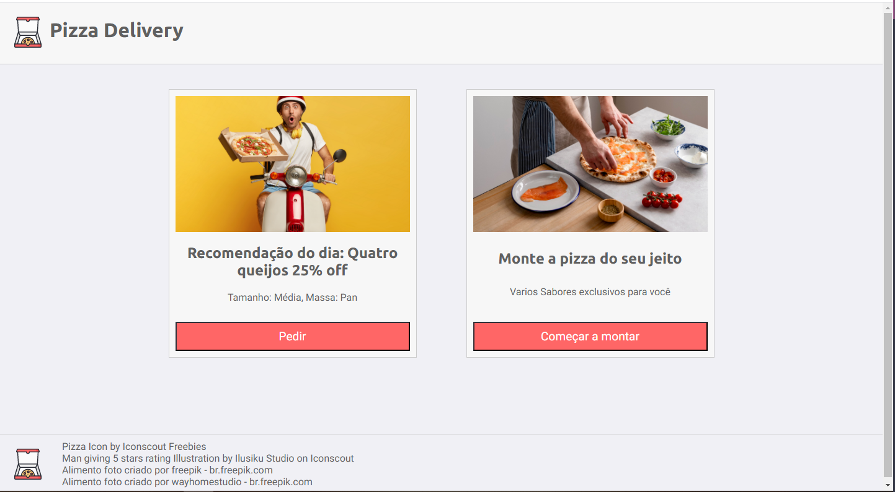
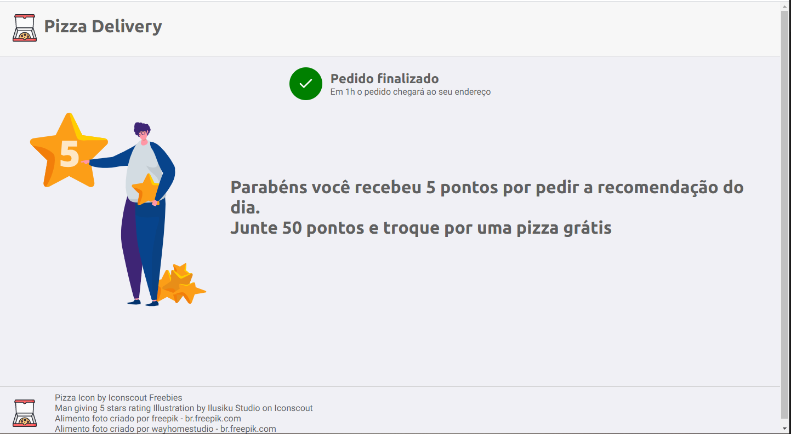
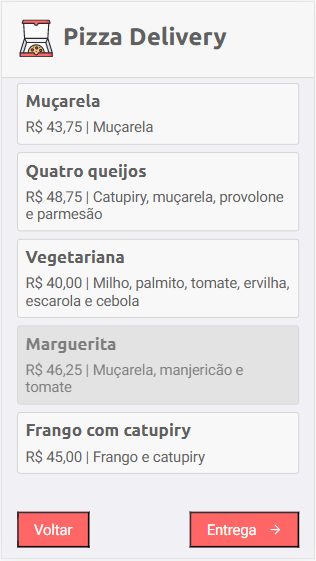
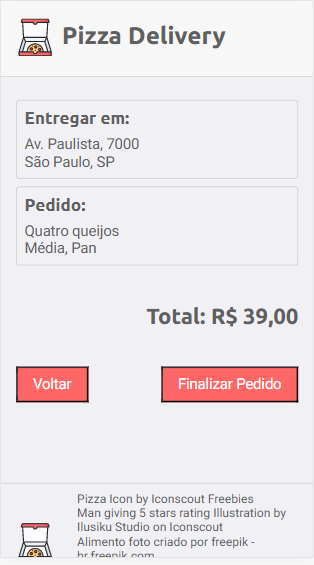

<h1 align="center">:pizza:Pizza Delivery</h1>
<p align="center">Pizza ordering system built with Nodejs and React</p>
<p align="center">
  <a href="#how-to-run">How to run</a> •
  <a href="#screens">Screens</a> 
</p>

## How to run

1. Download the repository to your computer, as shown below:
```cmd
git clone https://github.com/rogeriomattos/pizza-delivery
```
2. Access the backend folder at ./pizza-delivery/backend and install the dependencies with the command below
 ```cmd
 npm i
 ```
3. Finally to run the api use the command below
```cmd
npm run dev
```
4. open another terminal and access the frontend folder at ./pizza-delivery/frontend and install the dependencies with the command below
 ```cmd
 npm i
 ```
5. Finally to run use the command below
```cmd
npm start
```
## Screens

<p align="center">
  
  
</p>
<p align="center">
  
  
  
</p>
